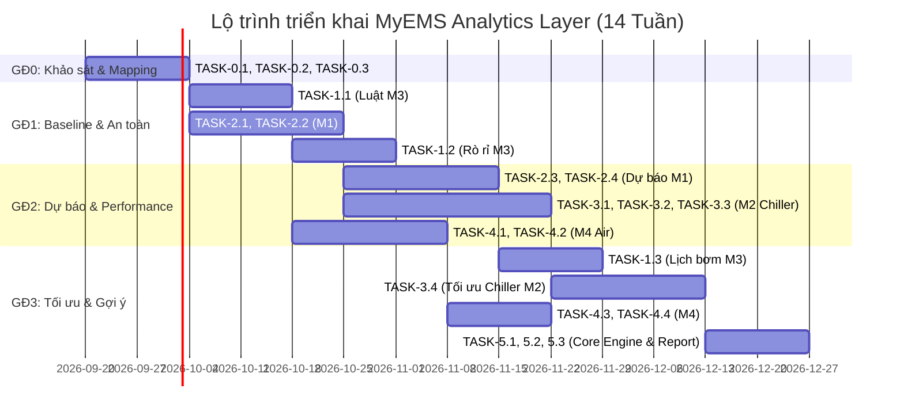

# SPECIFICATION THIẾT KẾ KỸ THUẬT & DANH SÁCH TASK THỰC THI
## Hệ thống M&E & Năng lượng Thông minh trên DMP (MyEMS Analytics Layer)

> **Tài liệu tham chiếu:** 
> - [problem.md](file:///d:/VIN_AITC/myems/problem.md): Phát biểu bài toán, phạm vi, pipeline 5 bước và các module M1–M4.
> - [tele.md](file:///d:/VIN_AITC/myems/tele.md): Danh mục 132 telemetry keys + 16 attribute keys v1.13 trên DMP.

---

## 1. TỔNG QUAN HỆ THỐNG & NGUYÊN TẮC THIẾT KẾ

### 1.1 Mục tiêu hệ thống
Xây dựng một **Lớp phân tích dùng chung (Analytics Layer)** trên DMP, tiếp nhận dữ liệu telemetry từ các hệ thống M&E của tòa nhà để:
1. **Học Baseline**: Xác định mức vận hành tiêu chuẩn/kỳ vọng (15 phút) cho từng thiết bị và khu vực theo thời gian, loại ngày, thời tiết và lưu lượng người.
2. **Phát hiện bất thường (Anomaly Detection)**: Cảnh báo sớm các sự cố an toàn, lãng phí năng lượng, vi phạm luật vật lý và suy giảm hiệu suất thiết bị.
3. **Dự báo (Forecasting)**: Dự báo phụ tải điện, tải lạnh, nhu cầu dùng nước và nồng độ $CO_2$/bụi mịn $PM_{2.5}$ trong 15 phút – 24 giờ.
4. **Gợi ý tối ưu (Recommendation)**: Xuất đề xuất vận hành (tổ hợp máy chạy, setpoint, lịch bơm) kèm ước tính kWh và tiền điện tiết kiệm (VND) theo biểu giá điện theo khung giờ (TOU Tariff).

### 1.2 Nguyên tắc vận hành bắt buộc
- **Read-Only / No Closed-Loop**: Hệ thống **CHỈ ĐỌC** các telemetry command/setpoint (`*_cmd`, `*_sp`). **KHÔNG GHI** bất kỳ lệnh nào xuống thiết bị. Người vận hành là người ra quyết định cuối cùng.
- **Data Resampling**: Tất cả dữ liệu đầu vào được resample về lưới thời gian chuẩn 15 phút.
- **Fail-safe Data Quality**: Phân biệt rõ trạng thái "Mất kết nối dữ liệu" (`reachable = 0`) với "Giá trị bằng 0" (`value = 0`).

---

## 2. MA TRẬN DỮ LIỆU TELEMETRY & CHUẨN HÓA

Hệ thống sử dụng các nhóm telemetry key từ `tele.md` phân bổ cho 4 module chính:

### 2.1 Ma trận Key × Module

| Nhóm Telemetry | Key đại diện | M1 Điện | M2 Chiller | M3 Nước | M4 Không khí |
|---|---|:---:|:---:|:---:|:---:|
| **Power meter (13)** | `power_active_kw`, `energy_active_kwh_total`, `power_factor`, `voltage_l1..l3`, `current_l1..l3`, `frequency_hz` | **CHÍNH** | Phụ | Phụ | |
| **HVAC Chiller (9)** | `cooling_kw`, `chiller_load_pct`, `chilled_water_supply_temp_c`, `chilled_water_return_temp_c`, `chilled_water_supply_pressure_bar`, `chilled_water_return_pressure_bar`, `chiller_state`, `chiller_state_cmd`, `runtime_min` | | **CHÍNH** | | |
| **HVAC Air-side (16)**| `supply_air_temp_c`, `fan_speed_pct`, `damper_state`, `diff_pressure_pa`, `air_flow_m3h`, `co2_ppm`, `cooling_tower_fan_state` | | Phụ | | **CHÍNH** |
| **Nước / Bơm (20)** | `pump_state`, `pump_speed_pct`, `water_flow_lpm`, `water_volume_m3_total`, `pressure_supply_bar`, `tank_level_low..high`, van | | Phụ | **CHÍNH** | |
| **Siemens NORIS (13)**| `active_power_kw`, `active_energy_kwh`, `cooling_load_kw`, `chw_supply_temp`, `chw_return_temp`, `evaporator_pressure`, `compressor_status` | Phụ | **CHÍNH** | | |
| **PHATTAI (12)** | `temperature`, `humidity`, `pm25`, `pm10`, `aqi`, `co`, `no2`, `o3`, `so2`, `wind_speed` | Phụ | **CHÍNH** | | **CHÍNH** |
| **Access ZKTeco (3)** | `record_count`, `door_state`, `online` | Phụ | Phụ | Phụ | **CHÍNH** |
| **Dùng chung (5)** | `fault`, `mode`, `state_on_off`, `state_on_off_cmd`, `lighting_knx_state` | Phụ | Phụ | Phụ | Phụ |
| **ICMP Ping (1)** | `reachable` | Phụ | Phụ | Phụ | Phụ |

### 2.2 Quy đổi & Mapping Dữ liệu
1. **Counter Reset Handling**: Đơn vị năng lượng tích lũy (`energy_active_kwh_total`, `water_volume_m3_total`) được tính chuyển đổi sang delta kỳ 15 phút:
   $$\Delta E_{15m} = E(t) - E(t-15m) \quad (\text{loại bỏ } \Delta E < 0 \text{ do reset counter})$$
2. **NORIS Adapter**: Mapping các key của Siemens NORIS (`active_power_kw`, `chw_supply_temp`,...) sang key chuẩn DMP (`power_active_kw`, `chilled_water_supply_temp_c`,...).
3. **Unit Conversion**: Đổi đơn vị đối với các nguồn dữ liệu ngoài (ví dụ LBNL: °F $\rightarrow$ °C, GPM $\rightarrow$ L/min, MBtu/h $\rightarrow$ kW).

---

## 3. KIẾN TRÚC PIPELINE 5 BƯỚC (ANALYTICS ENGINE ARCHITECTURE)

```
Telemetry DMP ──┐
Attribute DMP ──┼─► [Step 1] Resampling & Mapping (15m grid)
Dữ liệu ngoài ──┘         │
                          ▼
                    [Step 2] Baseline Engine (Lớp a: Vật lý | Lớp b: Lịch sử | Lớp c: So ngang)
                          │
                          ▼
                    [Step 3] Anomaly Engine (Spike | Drift | Command Mismatch | Efficiency Drop)
                          │
                          ▼
                    [Step 4] Forecasting Engine (Electric Load | Cooling Load | Water | CO2)
                          │
                          ▼
                    [Step 5] Optimization Engine (Safety -> Comfort -> TOU Tariff Cost)
                          │
                          ▼
                    Outputs: O1 (Baseline) | O2 (Events) | O3 (Forecast) | O4 (Recs) | O5 (Report)
```

### Dataclass Standards Đầu Ra (O1 - O5)
- **O1 (Baseline)**: JSON chứa `{entity_id, key, ts, expected, lower, upper, baseline_layer, context}`.
- **O2 (Anomaly Event)**: JSON chứa `{event_id, module, entity_id, type, severity, rule_or_model, start, end, evidence, estimated_waste_kwh, suggested_action}`.
- **O3 (Forecast)**: JSON chứa `{entity_id, key, issued_at, horizon, step, points: [{ts, p10, p50, p90}]}`.
- **O4 (Recommendation)**: JSON chứa `{rec_id, module, valid_from, valid_to, action, reason, constraints_checked, est_saving_kwh, est_saving_vnd, status}`.
- **O5 (Report)**: Định kỳ Báo cáo Tiêu thụ thực vs Baseline, Top thiết bị lãng phí, Tiết kiệm ước tính.

---

## 4. PHÂN CHIA DANH SÁCH TASK CẦN IMPLEMENT (TASK BREAKDOWN)

Hệ thống được chia thành 6 Work Packages (WP) thực thi tương ứng với lộ trình phát triển.

---

### WORK PACKAGE 0: DATA PIPELINE, INGESTION & DATA MODELLING (GĐ0 & GĐ1)

#### `TASK-0.1`: Thiết kế Database Schema & Data Models
- **Mục tiêu**: Xây dựng cấu trúc lưu trữ cho dữ liệu sạch 15m, Baseline (O1), Anomaly Events (O2), Forecasts (O3), Recommendations (O4), và Reports (O5).
- **Đầu ra**: Script DDL SQL (PostgreSQL / TimescaleDB) & Pydantic / dataclasses Data Models.
- **Mức độ ưu tiên**: High (Chặn toàn bộ dự án).

#### `TASK-0.2`: Ingestion, Normalization & Resampling Adapter
- **Mục tiêu**: Resample toàn bộ time-series về bước nhảy chuẩn 15 phút. Tính toán $\Delta E_{15m}$ từ counter tích lũy, xử lý cuộn counter.
- **Đầu ra**: Module `src/normalization/resampler.py` + Unit test cho counter reset & missing samples.
- **Mức độ ưu tiên**: High.

#### `TASK-0.3`: Multi-source Mapping & Data Quality Checker
- **Mục tiêu**: Lập bảng mapping key Siemens NORIS / PHATTAI / ZKTeco sang key chuẩn DMP. Gắn cờ data quality (`GOOD`, `MISSING`, `INVALID`, `GATEWAY_DOWN`).
- **Đầu ra**: Module `src/normalization/mapper.py` & `src/normalization/quality_checker.py`.
- **Mức độ ưu tiên**: High.

---

### WORK PACKAGE 1: MODULE M3 — NƯỚC & BƠM (AN TOÀN & LỊCH BƠM) (GĐ1)

#### `TASK-1.1`: Rule Engine — Luật An Toàn Vật Lý Real-time (Lớp a)
- **Mục tiêu**: Triển khai 6 luật an toàn không cần dữ liệu lịch sử:
  1. *Chạy khô*: `pump_state = ON` & (`tank_level_low = 1` hoặc `water_flow_lpm ≈ 0`) > N phút.
  2. *Tràn bồn*: `tank_level_high = 1` & `pump_state = ON`.
  3. *Van kẹt*: Lệnh mở/đóng van không phản hồi công tắc hành trình sau T giây.
  4. *Lệnh không đáp ứng*: `pump_state_cmd ≠ pump_state` sau T giây.
  5. *Limit switch mâu thuẫn*: Cả công tắc mở & đóng cùng Active.
  6. *Đóng cắt liên tục*: Số lần chuyển trạng thái bơm/giờ > Ngưỡng.
- **Đầu ra**: Module `src/m3_water/safety_rules.py` phát hiện và bắn ra sự kiện O2 ngay lập tức (Severity: `critical` / `warning`).
- **Mức độ ưu tiên**: High (Bàn giao sớm nhất cho vận hành).

#### `TASK-1.2`: Baseline Nước & Phát Hiện Rò Rỉ Ban Đêm
- **Mục tiêu**: Xây dựng baseline tiêu thụ nước ($m^3/15m$) và tính chỉ số `night_min_flow` (lưu lượng nhỏ nhất từ 1h–4h sáng) để phát hiện rò rỉ đường ống.
- **Đầu ra**: Module `src/m3_water/leakage_detector.py`.
- **Mức độ ưu tiên**: Medium.

#### `TASK-1.3`: Dự Báo Nhu Cầu Nước & Gợi Ý Lịch Bơm Theo Giá Điện (TOU Tariff)
- **Mục tiêu**: Dự báo nhu cầu nước theo giờ trong ngày. Tối ưu lịch bơm dồn vào giờ thấp điểm.
- **Ràng buộc cứng**: Mực nước bồn không bao giờ vi phạm `tank_level_low`, tôn trọng min ON/OFF time của bơm.
- **Đầu ra**: Module `src/m3_water/pump_scheduler.py` tạo ra gợi ý O4.
- **Mức độ ưu tiên**: Medium.

---

### WORK PACKAGE 2: MODULE M1 — ĐIỆN NĂNG (ANCHOR DỮ LIỆU) (GĐ1 & GĐ2)

#### `TASK-2.1`: Module Tính Toán Đại Lượng Điện Nẫn Xuất
- **Mục tiêu**: Tính toán các chỉ số derived từ Power Meter 13 keys:
  - $kWh_{15m} = \Delta energy\_active\_kwh\_total$
  - `phase_voltage_unbalance_pct` = $\frac{\max|V_{Lx} - V_{avg}|}{V_{avg}} \times 100\%$
  - `phase_current_unbalance_pct`
  - `peak_share_pct` (tỷ lệ kWh giờ cao điểm) & `after_hours_kwh` (kWh chạy ngoài giờ).
- **Đầu ra**: Module `src/m1_power/derived_metrics.py`.
- **Mức độ ưu tiên**: High.

#### `TASK-2.2`: Baseline Phụ Tải Điện 3 Lớp
- **Mục tiêu**: 
  - Lớp (a): Ràng buộc giới hạn định mức công suất tủ/đồng hồ.
  - Lớp (b): Profile lịch sử theo [Loại ngày (Workday/Weekend/Holiday) × Khung giờ 15m × Nhiệt độ ngoài trời].
  - Lớp (c): Peer-group comparison giữa các tủ/khu vực tương đương.
- **Đầu ra**: Engine `src/m1_power/baseline_engine.py` xuất ra kết quả O1.
- **Mức độ ưu tiên**: High.

#### `TASK-2.3`: Dự Báo Phụ Tải Điện 24h (Electric Load Forecasting)
- **Mục tiêu**: Dự báo phụ tải `power_active_kw` cho 24h tới (96 bước 15m), bao gồm khoảng tin cậy P10, P50, P90.
- **Thuật toán**: XGBoost / Prophet / LightGBM tích hợp feature calendar & thời tiết PHATTAI.
- **Đầu ra**: Model `src/m1_power/load_forecaster.py` xuất ra kết quả O3.
- **Mức độ ưu tiên**: Medium.

#### `TASK-2.4`: Phát Hiện Bất Thường Điện Năng
- **Mục tiêu**: Phát hiện: Chạy ngoài giờ (*After-hours running*), Base load tăng dần, Spike công suất, Hệ số công suất thấp ($PF < 0.85$), Lệch pha điện áp/dòng điện.
- **Đầu ra**: Module `src/m1_power/anomaly_detector.py` tạo sự kiện O2 kèm ước tính $kWh$ lãng phí.
- **Mức độ ưu tiên**: High.

---

### WORK PACKAGE 3: MODULE M2 — CHILLER PLANT (VERTICAL CHỦ ĐẠO) (GĐ2 & GĐ3)

#### `TASK-3.1`: Module Tính Toán Đại Lượng Dẫn Xuất Chiller & Đối Soát Vật Lý
- **Mục tiêu**: Tính toán các đại lượng KPI hiệu suất Chiller:
  - $\Delta T_{chw} = T_{return} - T_{supply}$
  - $kW/kW_{cooling} = \frac{\text{active\_power\_kw}}{\text{cooling\_kw}}$ (hoặc $COP = \frac{\text{cooling\_kw}}{\text{active\_power\_kw}}$, $kW/RT$)
  - Kiểm chéo tải lạnh vật lý: $Q_{thermal} \approx 4.186 \times \frac{water\_flow\_lpm}{60} \times \Delta T_{chw}$
- **Đầu ra**: Module `src/m2_chiller/metrics_calculator.py`.
- **Mức độ ưu tiên**: High.

#### `TASK-3.2`: Mô Hình Dự Báo Tải Lạnh 24h (Cooling Load Forecast)
- **Mục tiêu**: Dự báo `cooling_kw` 24h tới (bước 15m) phục vụ điều hành Chiller Plant.
- **Features**: Lịch tòa nhà, Nhiệt độ/Độ ẩm dự báo (PHATTAI), Proxy số lượng người ($ZKTeco$).
- **Đầu ra**: Model `src/m2_chiller/cooling_forecaster.py` (Mục tiêu MAPE $\le 15\%$).
- **Mức độ ưu tiên**: High.

#### `TASK-3.3`: Mô Hình Đường Cong Hiệu Suất Từng Chiller (Performance Curve)
- **Mục tiêu**: Xây dựng mô hình đường cong hiệu suất $kW/kW_{cooling}$ (hoặc $COP$) theo % tải (`chiller_load_pct`) và Nhiệt độ môi trường ngoài trời cho từng máy Chiller.
- **Phát hiện bất thường**: Máy bị suy giảm hiệu suất so với chính nó trong quá khứ (>10–15%) hoặc so với máy cùng model; Hội chứng $\Delta T$ thấp (*Low $\Delta T$ syndrome*).
- **Đầu ra**: Module `src/m2_chiller/performance_curve.py`.
- **Mức độ ưu tiên**: High.

#### `TASK-3.4`: Thuật Toán Gợi Ý Tổ Hợp Chiller & Setpoint Nước Lạnh Cấp (Plant Optimization)
- **Mục tiêu**: Dựa trên tải lạnh dự báo 24h, đề xuất:
  1. Tổ hợp số lượng máy chiller nên chạy theo từng khung giờ.
  2. Thời điểm khởi động/chạy đón tải buổi sáng.
  3. Setpoint nhiệt độ nước lạnh cấp ($T_{supply\_sp}$) tối ưu.
- **Ràng buộc**: $T_{supply} \le 7.5^\circ C$ (Tiện nghi), Min runtime máy nén, Cân bằng giờ chạy (`runtime_min`).
- **Ước tính**: $kWh$ và $VND$ tiết kiệm được so với cách vận hành thực tế.
- **Đầu ra**: Engine `src/m2_chiller/plant_optimizer.py` xuất gợi ý O4.
- **Mức độ ưu tiên**: High.

---

### WORK PACKAGE 4: MODULE M4 — KHÔNG KHÍ / CO2 / THÔNG GIÓ (GĐ2 & GĐ3)

#### `TASK-4.1`: Spatial Mapping & Occupancy Proxy Calculator
- **Mục tiêu**: Lập bảng quan hệ Topology: Cửa ZKTeco $\leftrightarrow$ Vùng cảm biến $CO_2$ $\leftrightarrow$ PAU/quạt phục vụ. Tính `occupancy_proxy` = $\Delta record\_count$ 15 phút.
- **Đầu ra**: Configuration file `config/topology_m4.json` & module `src/m4_air/occupancy_adapter.py`.
- **Mức độ ưu tiên**: Medium.

#### `TASK-4.2`: Dự Báo $CO_2$ Vùng (15–30m) & $PM_{2.5}$ Ngoài Trời
- **Mục tiêu**:
  - Dự báo $CO_2$ trong nhà dựa trên phương trình cân bằng khối lượng: $\frac{dCO_2}{dt} \approx k_1 \cdot Occ - k_2 \cdot AirFlow \cdot (CO_2^{in} - CO_2^{out})$.
  - Dự báo $PM_{2.5}$ và $AQI$ ngoài trời từ trạm PHATTAI (1–3h).
- **Đầu ra**: Model `src/m4_air/air_forecaster.py`.
- **Mức độ ưu tiên**: Medium.

#### `TASK-4.3`: Phát Hiện Bất Thường Thông Gió & Tắc Lọc
- **Mục tiêu**:
  - Phát hiện xu hướng tắc lọc gió thông qua độ dốc chênh áp `diff_pressure_pa` tại cùng cấp tốc độ quạt `fan_speed_pct`.
  - Cảnh báo $CO_2$ vượt ngưỡng dù quạt đang chạy (do van gió damper kẹt hoặc lưu lượng thấp).
  - Quạt chạy khi vùng không có người.
- **Đầu ra**: Module `src/m4_air/anomaly_detector.py`.
- **Mức độ ưu tiên**: Medium.

#### `TASK-4.4`: Gợi Ý Điều Chỉnh Tốc Độ Quạt & Tỷ Lệ Gió Tươi
- **Mục tiêu**: Đưa ra khuyến nghị tăng tốc độ quạt trước khi $CO_2$ vượt ngưỡng; giảm gió tươi tạm thời khi ngoài trời ô nhiễm nặng ($PM_{2.5}$ cao); giảm quạt khi vắng người.
- **Đầu ra**: Module `src/m4_air/ventilation_optimizer.py` xuất gợi ý O4.
- **Mức độ ưu tiên**: Low.

---

### WORK PACKAGE 5: CORE FRAMEWORK INTEGRATION, RECOMMENDATION & REPORTING (GĐ3)

#### `TASK-5.1`: Recommendation & Savings Evaluation Engine
- **Mục tiêu**: Tổng hợp toàn bộ khuyến nghị từ M1, M2, M3, M4. Tính toán tiền tiết kiệm $VND = kWh_{saved} \times \text{Tariff}(t)$ và kiểm tra xung đột giữa các gợi ý.
- **Đầu ra**: Module `src/core/recommendation_engine.py`.
- **Mức độ ưu tiên**: High.

#### `TASK-5.2`: Báo Cáo Định Kỳ (O5 Output Service) & Backtest Engine
- **Mục tiêu**: Tự động tổng hợp báo cáo định kỳ ngày/tuần/tháng (Tiêu thụ vs Baseline, Top thiết bị lãng phí, Tỷ lệ mất mẫu dữ liệu, Backtest số tiền tiết kiệm).
- **Đầu ra**: Module `src/core/reporting_service.py` & `src/core/backtester.py`.
- **Mức độ ưu tiên**: High.

#### `TASK-5.3`: API & Dashboard Data Interface
- **Mục tiêu**: Xây dựng API endpoints (RESTful/GraphQL) để giao diện UI MyEMS đọc được các đầu ra O1, O2, O3, O4, O5.
- **Đầu ra**: FastAPI application trong `myems-api` hoặc service chuyên biệt.
- **Mức độ ưu tiên**: High.

---

## 5. BẢNG TIÊU CHÍ NGHIỆM THU (ACCEPTANCE CRITERIA)

| Hạng mục nghiệm thu | Chỉ số đánh giá | Mục tiêu cam kết |
|---|---|---|
| **Chất lượng dữ liệu** | Tỷ lệ mẫu hợp lệ sau chuẩn hóa | $\ge 99\%$ dữ liệu thời gian thực được làm sạch & resample |
| **Luật an toàn (M3)** | Phát hiện sự cố chạy khô / tràn / van kẹt | **Bỏ sót = 0** trên tập kịch bản thử nghiệm / log lịch sử |
| **Bất thường (M1-M4)** | Precision của cảnh báo sự kiện | $\ge 80\%$ (trên tập sự kiện có nhãn xác minh) |
| **Dự báo phụ tải điện (M1)** | Sai số MAPE (24h) | $\le 10 - 15\%$ trong giờ vận hành |
| **Dự báo tải lạnh (M2)** | Sai số MAPE (24h) | $\le 15\%$ trong giờ vận hành |
| **Dự báo $CO_2$ (M4)** | Sai số tuyệt đối trung bình MAE (30 phút) | $\le 100 \text{ ppm}$ |
| **Gợi ý & Tiết kiệm** | Báo cáo chứng minh tiết kiệm (Backtest) | Có số liệu tiết kiệm kWh & VND rõ ràng cho M1, M2, M3 |
| **Minh bạch thông tin** | Bằng chứng cho mỗi Warning/Gợi ý | **100%** gợi ý/cảnh báo đều kèm đầy đủ bằng chứng (key, thời gian, baseline) |

---

## 6. LỘ TRÌNH THỰC THI (TIMELINE & PHÂN CÔNG MODEL)



### Phân công trách nhiệm:
- **Module M1 (Điện năng)**: Đức (Phụ trách TASK-2.1 $\rightarrow$ TASK-2.4)
- **Module M2 (Chiller)**: Đôn (Phụ trách TASK-3.1 $\rightarrow$ TASK-3.4)
- **Module M3 (Nước/Bơm)**: Bảo (Phụ trách TASK-1.1 $\rightarrow$ TASK-1.3)
- **Module M4 (Không khí/CO2)**: Thành viên còn lại (Phụ trách TASK-4.1 $\rightarrow$ TASK-4.4)
- **Core Framework & Database (WP0 & WP5)**: Phụ trách chung, thống nhất Interface Data Contracts (O1–O5).
